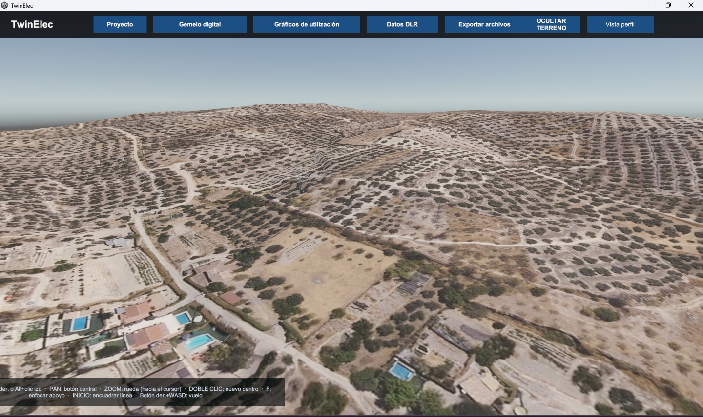
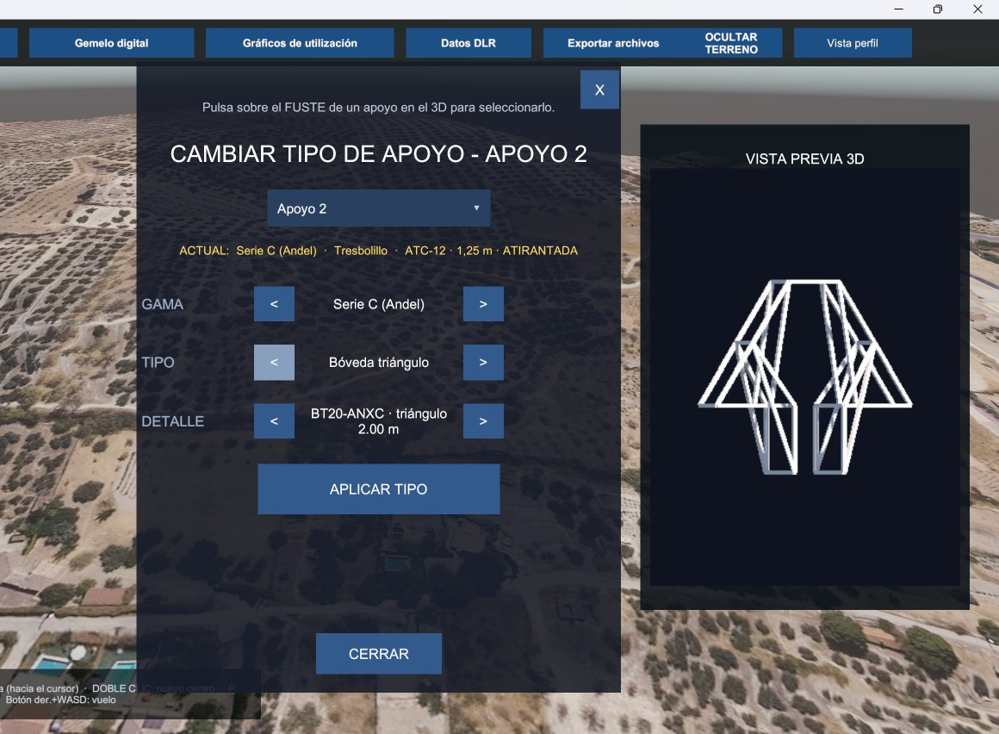
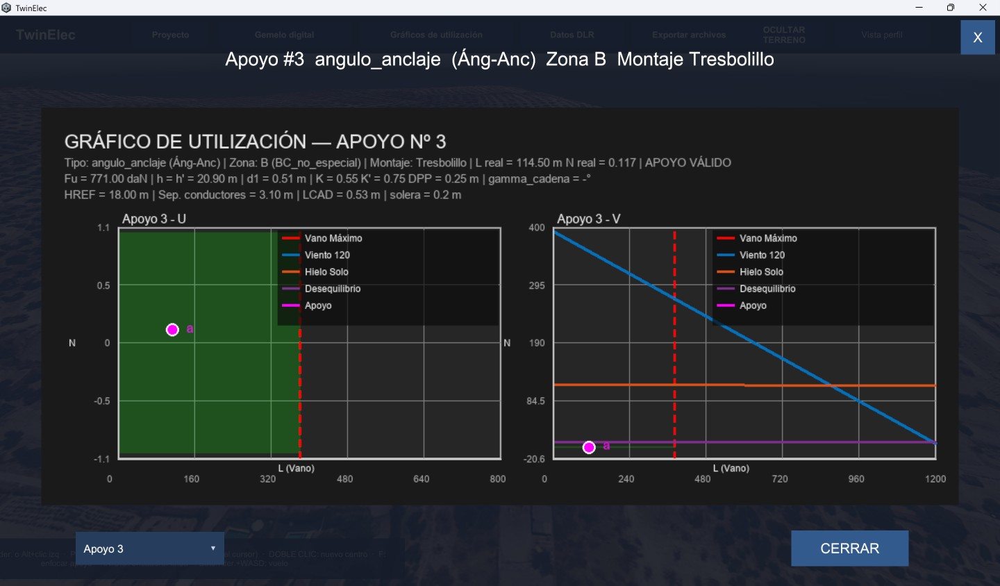
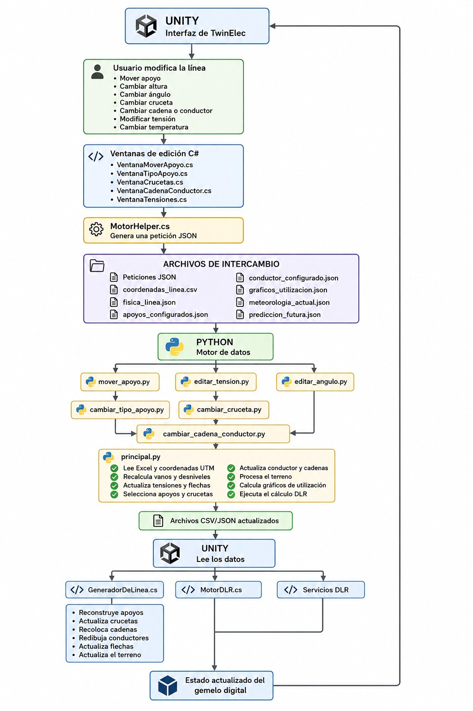

# TwinElec

**Gemelo digital para líneas eléctricas aéreas AT/MT**  
Proyecto Fin de Grado · Grado en Ingeniería Eléctrica · Universidad de Jaén

[English version](#english)



TwinElec convierte la documentación técnica de una línea aérea de alta o media tensión en un modelo 3D
interactivo. El objetivo es estudiar la línea desde la ingeniería eléctrica:
geometría de apoyos, crucetas y bóvedas, cadenas de aisladores, conductores,
catenarias, estados mecánicos y capacidad dinámica. Unity, Python, C# y Blender
son las herramientas que hacen posible ese flujo; no son el fin del proyecto.

## En menos de un minuto

- **Entrada:** Excel exportado por Andelec, coordenadas UTM, cuadros de cálculo y,
  opcionalmente, MDT/ortofotografía PNOA.
- **Modelo:** terreno, apoyos modulares, armados, crucetas o bóvedas, cadenas y
  conductores representados como catenarias.
- **Edición:** posición y altura del apoyo, ángulo, tipo de apoyo, cruceta,
  cadena, conductor, tensión y temperatura.
- **Cálculo:** vanos y desniveles, tensión y flecha, hipótesis de viento/hielo,
  esfuerzos verticales-transversales-longitudinales y gráficos de utilización.
- **Operación:** cálculo DLR basado en IEEE 738 con control de calidad de los
  datos meteorológicos; un fallback nunca se presenta como límite operativo.
- **Salida:** Excel de trabajo recalculado, coordenadas actualizadas, perfil y
  archivos CSV/JSON que vuelven a alimentar el gemelo.

## Problema que resuelve

El diseño de una línea aérea combina información geométrica, mecánica,
eléctrica, meteorológica y geográfica repartida entre documentos y herramientas.
TwinElec reúne esas fuentes en una representación navegable y permite comprobar
visualmente el efecto de una modificación sin perder la trazabilidad del dato
técnico de origen.

| Ingeniería implementada | Resultado en TwinElec |
|---|---|
| Apoyos, fustes, crucetas y bóvedas | Selección de modelos y montaje 3D por apoyo |
| Cadenas de suspensión y amarre | Colocación y actualización de puntos de conexión |
| Conductores y vanos | Catenarias continuas y arcos de amarre |
| Cambio de estado | Recalcula tensión y flecha con la temperatura |
| Viento, hielo y desequilibrio | Esfuerzos y límites para gráficos de utilización |
| DLR | Capacidad térmica dinámica mediante el balance IEEE 738 |

<table>
  <tr>
    <td></td>
    <td></td>
  </tr>
  <tr>
    <td align="center">Edición de apoyos, armados y montaje</td>
    <td align="center">Comprobación mecánica del apoyo</td>
  </tr>
</table>

## Arquitectura e integración con Andelec



1. Python interpreta los documentos exportados por **Andelec** y las coordenadas
   UTM, valida catálogos y genera el estado común de la línea.
2. Unity/C# construye el gemelo y presenta las herramientas de inspección y
   edición.
3. Cada cambio se envía al motor Python mediante una petición JSON.
4. El motor recalcula el Excel de trabajo y los CSV/JSON; Unity reconstruye solo
   los elementos afectados.
5. La aplicación puede exportar los resultados sin sobrescribir los documentos
   originales.

El repositorio no incluye Andelec ni documentación propietaria. Incluye un
pequeño ejemplo anonimizado compatible con el flujo que realmente usa TwinElec.

## Tecnologías y función

| Tecnología | Uso dentro del proyecto |
|---|---|
| Unity 6 / C# | Gemelo digital, interfaz, navegación, edición y motor DLR equivalente |
| Python | Lectura de Excel/Word/GeoTIFF, cálculos mecánicos, DLR y sincronización |
| Blender | Modelado paramétrico y biblioteca de apoyos, crucetas y cadenas |
| Andelec | Fuente de los documentos de cálculo de la línea |
| PNOA/MDT05 | Relieve y textura georreferenciada; no se versionan mosaicos pesados |

## Ejecución básica

Requisitos validados: **Unity 6000.4.0f1**, **Python 3.14** y Windows para el
build de escritorio.

```powershell
py -3.14 -m venv .venv
.\.venv\Scripts\Activate.ps1
python -m pip install -r requirements-dev.txt

$env:PYTHONPATH = (Resolve-Path "src/python")
python -m pytest tests/python -q
```

Para explorar el gemelo, añada la carpeta `unity/` a Unity Hub y abra la escena
incluida. El ejemplo mantenido está en `data/examples/demo_line/`. Para regenerar
sus datos técnicos:

```powershell
Set-Location data/examples/demo_line
python ../../../src/python/principal.py
```

La preparación de un ejecutable autónomo y de su carpeta `Datos/` se documenta
en [BUILD_AND_RUN.md](docs/BUILD_AND_RUN.md). Los mosaicos PNOA completos se
obtienen externamente según [DATA_AND_ATTRIBUTION.md](docs/DATA_AND_ATTRIBUTION.md).

## Estructura

```text
TwinElec/
├── unity/             # Proyecto Unity completo: Assets, Packages, ProjectSettings
├── src/python/        # Motor de datos y cálculos de ingeniería
├── blender/           # Fuentes .blend y scripts de generación/exportación
├── data/              # Catálogos y ejemplo anonimizado
├── tests/             # Pruebas Python; las EditMode viven con el proyecto Unity
├── docs/              # Arquitectura, datos, seguridad, validación e imágenes
└── release/           # Instrucciones; los builds generados no se versionan
```

Más detalle: [arquitectura](docs/ARCHITECTURE.md) ·
[validación](docs/VALIDATION.md) · [seguridad](docs/SECURITY.md).

Estado verificado: **15 pruebas Python + 6 subpruebas**, **6 pruebas Unity
EditMode**, compilación Unity limpia y build Windows x86_64 correcto.

## Datos, seguridad y alcance

- Las antiguas claves AEMET/SiAR se consideran comprometidas. El código actual
  solo lee variables de entorno o un `secrets.local.json` ignorado por Git.
- `secrets.example.json` contiene únicamente campos vacíos.
- El ejemplo desplaza y anonimiza las coordenadas del caso original.
- La consulta meteorológica en vivo requiere credenciales propias y datos de
  referencia externos. Sin datos válidos, TwinElec muestra estado de fallback,
  no una capacidad operativa.
- La reescritura del historial Git se ha pospuesto deliberadamente; véase el
  aviso en [SECURITY.md](docs/SECURITY.md).

---

<a id="english"></a>

## English

**Digital twin for MV/HV overhead power lines**  
Final Degree Project · BSc in Electrical Engineering · University of Jaén

TwinElec transforms overhead-line engineering documents into an interactive 3D
model. Its focus is electrical engineering—supports, cross-arms and vaults,
insulator strings, conductors, catenaries, mechanical states and dynamic line
rating. Unity, Python, C# and Blender are engineering tools used to connect those
domains.

### At a glance

- **Inputs:** Andelec-exported workbook, UTM coordinates, calculation tables and
  optional PNOA elevation/orthophoto data.
- **Digital model:** terrain, modular supports, cross-arms/vaults, insulator
  strings and continuous conductor catenaries.
- **Editing:** support position/height/angle/type, cross-arm, string, conductor,
  tension and temperature.
- **Engineering:** span geometry, tension and sag, wind/ice load cases,
  vertical-transverse-longitudinal forces and support utilisation diagrams.
- **DLR:** IEEE 738 thermal balance with meteorological quality checks; cached or
  fallback weather is never reported as an operational limit.
- **Outputs:** recalculated working workbook, updated coordinates, profile image
  and the CSV/JSON state consumed again by Unity.

### Why it exists

Overhead-line design combines electrical, mechanical, geographic and weather
information spread across several documents and tools. TwinElec brings those
sources into one inspectable model and shows the effect of engineering changes
while preserving the link to the source calculations.

### Architecture and Andelec workflow

Python parses and validates the Andelec exports, UTM documents, catalogues and
GeoTIFF inputs. Unity/C# builds the scene and exposes the editing workflow.
Edits travel to Python as JSON requests; the motor updates the working workbook
and shared CSV/JSON files, then Unity refreshes the affected geometry. Results
can be exported without overwriting the original input documents.

Andelec itself and proprietary documentation are not distributed. The repository
contains a compact, anonymised example that exercises the real TwinElec flow.

### Implemented electrical engineering

| Implemented domain | TwinElec result |
|---|---|
| Supports, shafts, cross-arms and vaults | Per-support 3D model and assembly selection |
| Suspension and strain strings | Placement and updated conductor connection points |
| Conductors and spans | Continuous catenaries and strain jumpers |
| Change of state | Temperature-dependent tension and sag recalculation |
| Wind, ice and unbalanced tension | Loads, forces and utilisation boundaries |
| DLR | IEEE 738 thermal balance and dynamic current limit |

### Technologies and their role

| Technology | Engineering role |
|---|---|
| Unity 6 / C# | Digital twin, interaction, editing and equivalent DLR motor |
| Python | Excel/Word/GeoTIFF processing, mechanics, DLR and synchronisation |
| Blender | Parametric modelling and the support/cross-arm/string library |
| Andelec | Source of the line calculation documents |
| PNOA/MDT05 | Georeferenced terrain and imagery, obtained outside Git |

### Run and inspect

The validated environment is Unity **6000.4.0f1**, Python **3.14**, and Windows
for the desktop build.

```powershell
py -3.14 -m venv .venv
.\.venv\Scripts\Activate.ps1
python -m pip install -r requirements-dev.txt
$env:PYTHONPATH = (Resolve-Path "src/python")
python -m pytest tests/python -q
```

Add `unity/` to Unity Hub to inspect the project and included scene. The
maintained input is in `data/examples/demo_line/`; it can be regenerated by
running `src/python/principal.py` with that directory as the working directory.

See [build instructions](docs/BUILD_AND_RUN.md),
[architecture](docs/ARCHITECTURE.md), [data and attribution](docs/DATA_AND_ATTRIBUTION.md),
[validation](docs/VALIDATION.md), and [security notes](docs/SECURITY.md).

Verified status: **15 Python tests + 6 subtests**, **6 Unity EditMode tests**, a
clean Unity compilation, and a successful Windows x86_64 build.

The public example contains shifted coordinates and no live credentials. Full
PNOA mosaics, private station data and third-party manuals are intentionally not
stored in Git.

### Repository map

`unity/` is the complete Unity project; `src/python/` is the engineering motor;
`blender/` holds editable sources and export scripts; `data/` contains catalogues
and the anonymised example; `tests/` and `docs/` provide validation and deeper
technical context. Generated desktop binaries stay locally under `release/` and
are ignored by Git.
