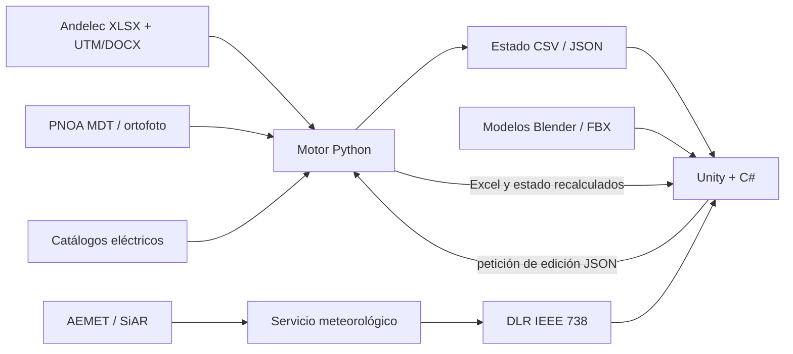

# Arquitectura de TwinElec

TwinElec separa la adquisición y transformación de datos, el cálculo de
ingeniería y la representación. Esta división permite cambiar una línea o un
modelo 3D sin introducir fórmulas dentro de la interfaz.

## Capas

### Documentos y geografía

`principal.py` localiza el Excel de línea, el documento de coordenadas y los
GeoTIFF disponibles. De ellos obtiene la secuencia de apoyos, vanos, desniveles,
conductor, configuraciones mecánicas y terreno. El ejemplo de portfolio mantiene
la estructura real de entrada con coordenadas desplazadas.

### Motor de ingeniería Python

- `tensiones_vanos.py`, `sobrecargas.py` y `reglamento.py`: estados mecánicos y
  acciones de viento/hielo.
- `cambiar_*`, `editar_*` y `mover_apoyo.py`: operaciones de edición y
  actualización del Excel de trabajo.
- `generar_graficos_utilizacion.py` y módulos asociados: límites y punto real de
  cada apoyo.
- `dlr.py`: balance térmico y corriente admisible según IEEE 738.
- `clima.py`: adquisición meteorológica, selección de estación, calidad,
  caché/fallback y publicación atómica para Unity.

### Aplicación Unity/C#

`GeneradorDeLinea.cs` construye terreno, apoyos, cadenas y conductores desde el
estado compartido. Las ventanas `Ventana*.cs` recogen una decisión de ingeniería
y delegan el cálculo en el motor mediante `MotorHelper.cs`. `MotorDLR.cs` ofrece
la implementación C# contrastada con los mismos casos que Python.

### Modelos 3D

Los `.blend` mantenidos están en `blender/models/`. Los scripts de
`blender/scripts/` generan o exportan la biblioteca FBX utilizada por
`unity/Assets/Resources/`. Los FBX forman parte del runtime; los `.blend` son las
fuentes editables.

## Contratos de intercambio

Los principales archivos compartidos son:

- `coordenadas_linea.csv`: posiciones locales y orientación;
- `apoyos_configurados.json`: geometría y montaje de cada apoyo;
- `conductor_configurado.json`: propiedades geométricas, mecánicas y eléctricas;
- `fisica_linea.json`: vanos, cantones, tensión y flecha;
- `graficos_utilizacion.json`: restricciones y punto de trabajo;
- `meteorologia_actual.json`: observación, procedencia y estado de calidad;
- `caso_referencia_nivel1*.json`: casos deterministas del motor DLR.

Las rutas se resuelven en `twinelec_paths.py` y `RutasGemelo.cs`. En el Editor
apuntan al repositorio; en el ejecutable apuntan a `Datos/` junto a
`TwinElec.exe`.
